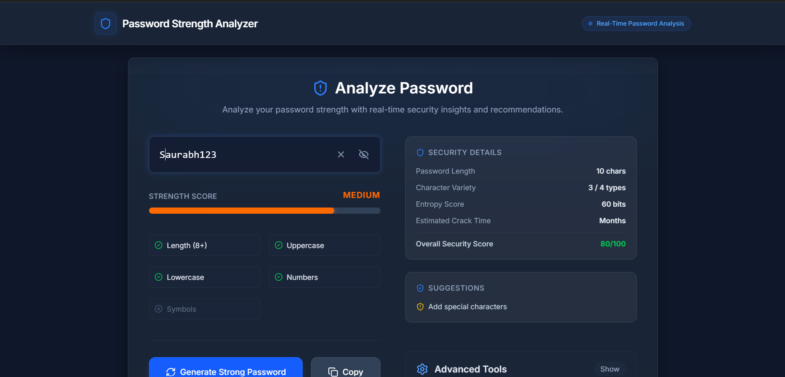
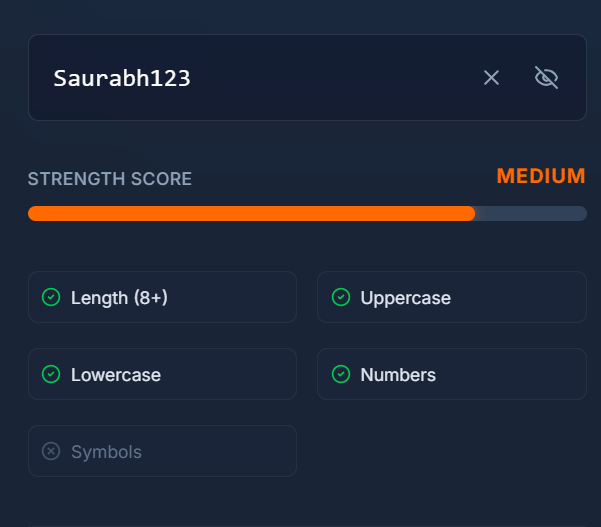
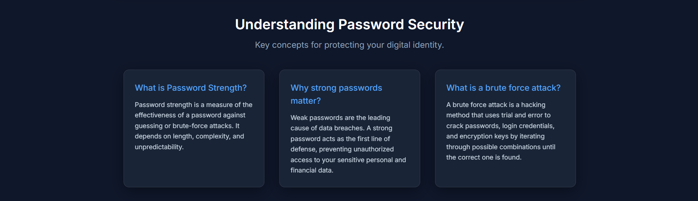
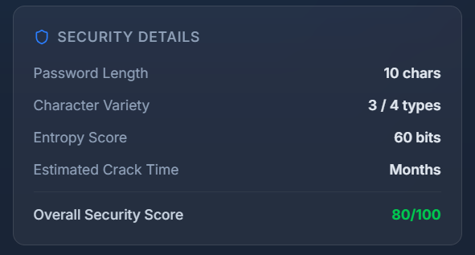
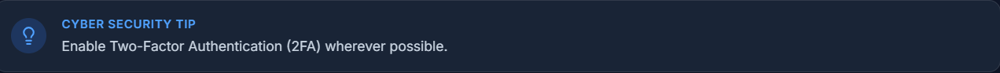

# 🔐 Secure Password Strength Analyzer

> **A DecodeLabs Cyber Security Internship Project**

A modern and interactive Password Strength Analyzer built using **React**, **TypeScript**, and **Vite**. This application analyzes password strength in real time, provides intelligent security recommendations, estimates password complexity, and educates users about password security best practices.

---

# 📌 Project Overview

This project was developed as part of the **DecodeLabs Cyber Security Internship** to promote cyber security awareness and secure password practices.

The application evaluates passwords using multiple security parameters such as password length, character diversity, entropy estimation, and crack-time prediction. It also provides educational resources to help users understand the importance of creating secure passwords.

---

# ✨ Key Features

- 🔍 Real-Time Password Strength Analysis
- 📊 Security Score Calculation
- 🔐 Password Entropy Estimation
- ⏳ Estimated Password Crack Time
- 🔤 Character Variety Detection
- 📏 Password Length Validation
- 💡 Smart Security Suggestions
- 🎲 Strong Password Generator
- 📋 Copy Password Functionality
- 📚 Password Security Education
- 🛡️ Cyber Security Tips
- 📱 Fully Responsive Design
- ⚡ Fast and Interactive User Interface

---

# 🛠️ Technologies Used

| Technology | Purpose |
|------------|---------|
| React | Frontend Framework |
| TypeScript | Type Safety |
| Vite | Build Tool |
| HTML5 | Structure |
| CSS3 | Styling |
| JavaScript (ES6+) | Functionality |
| Lucide React | Icons |

---

# 📂 Project Structure

```text
Secure-Password-Strength-Analyzer/
│
├── src/
│
├── screenshots/
│   ├── home.png
│   ├── analysis.png
│   ├── password-security.png
│   ├── security-guide.png
│   └── cyber-security-tip.png
│
├── index.html
├── package.json
├── tsconfig.json
├── vite.config.ts
├── README.md
└── .gitignore
```

---

# 💻 How to Use

1. Enter your password in the input field.
2. Instantly view your password strength score.
3. Check password complexity and entropy score.
4. Review the estimated password crack time.
5. Follow the security recommendations.
6. Generate a secure password if required.
7. Learn password security concepts from the educational section.

---

# 📸 Project Screenshots

## 🏠 Home Page



---

## 🔍 Password Analysis



---

## 📘 Understanding Password Security



---

## 🛡️ Security Guide



---

## 💡 Cyber Security Tip



---

# 🎯 Objectives

- Promote strong password practices.
- Improve cyber security awareness.
- Help users create secure passwords.
- Demonstrate modern React development skills.
- Build a professional cyber security portfolio project.

---

# 📈 Future Improvements

- Password Breach Detection
- AI-Based Password Suggestions
- Dark/Light Theme Toggle
- Password History Analysis
- Password Manager Integration
- Multi-Language Support
- Export Password Report
- Advanced Security Metrics

---

# 🎓 Learning Outcomes

During this project, I gained practical experience in:

- React Development
- TypeScript Programming
- Modern Frontend Development
- Responsive Web Design
- Password Security Principles
- Cyber Security Awareness
- Real-Time Data Processing
- Git & GitHub Workflow
- Technical Documentation

---

# 🏢 Internship Details

**Company:** DecodeLabs

**Internship Domain:** Cyber Security

**Project Title:** Secure Password Strength Analyzer

This project was developed during the **DecodeLabs Cyber Security Internship Program** to strengthen practical knowledge of secure password creation, cyber security awareness, and modern web application development.

---

# 👨‍💻 Developer

**Saurabh Prasad Gupta**

Computer Science & Engineering Student

Interested in:

- Cyber Security
- Web Development
- Software Engineering
- Problem Solving

GitHub: https://github.com/flxtiger

LinkedIn: https://linkedin.com/in/saurabhguptaji

---

# 📄 License

This project is developed for educational, learning, and portfolio purposes as part of the DecodeLabs Cyber Security Internship.

---

# 🤝 Contributing

Contributions, suggestions, and improvements are always welcome.

If you have ideas to improve this project, feel free to fork the repository and submit a pull request.

---

# ⭐ Support

If you found this project helpful, please consider giving it a **Star ⭐** on GitHub.

---

# 🙏 Acknowledgement

I would like to thank **DecodeLabs** for providing the opportunity to work on this project as part of the Cyber Security Internship Program. This project helped me strengthen my practical skills in secure application development, password security, and modern frontend technologies.

---

# ❤️ Thank You

Thank you for visiting this repository.

If you like this project, don't forget to ⭐ Star the repository.