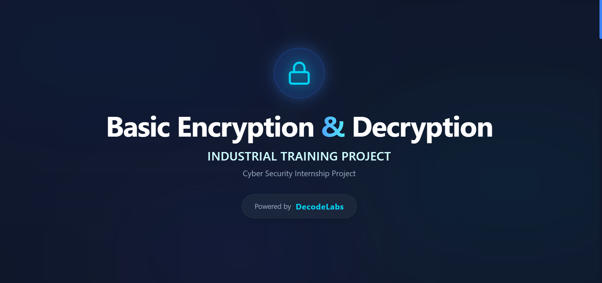
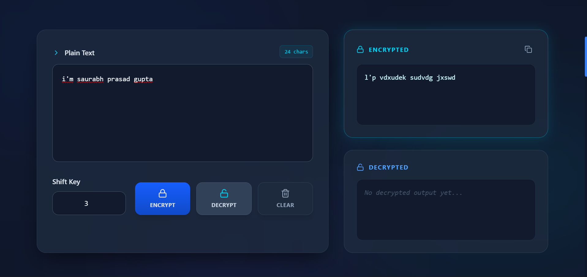
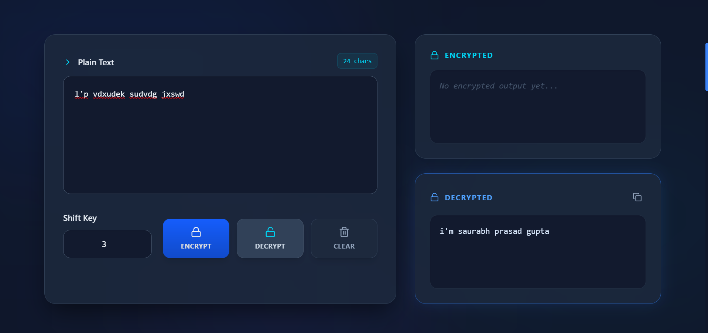
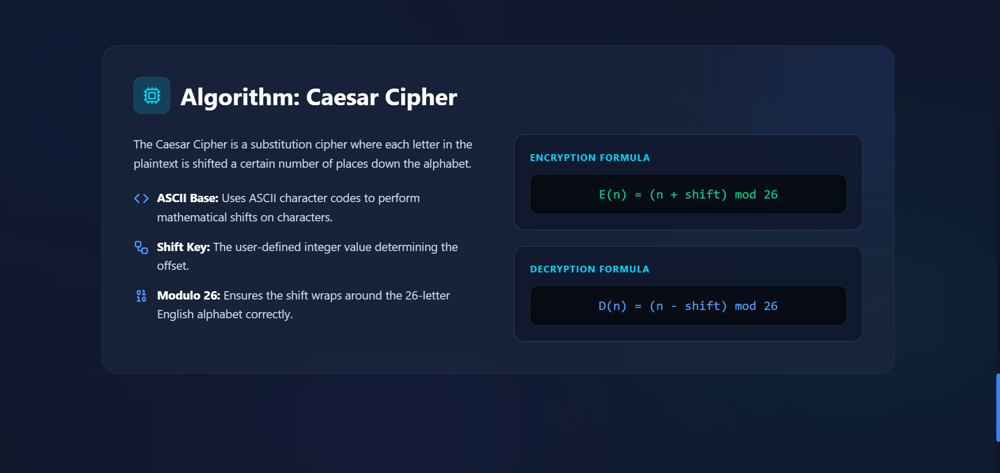
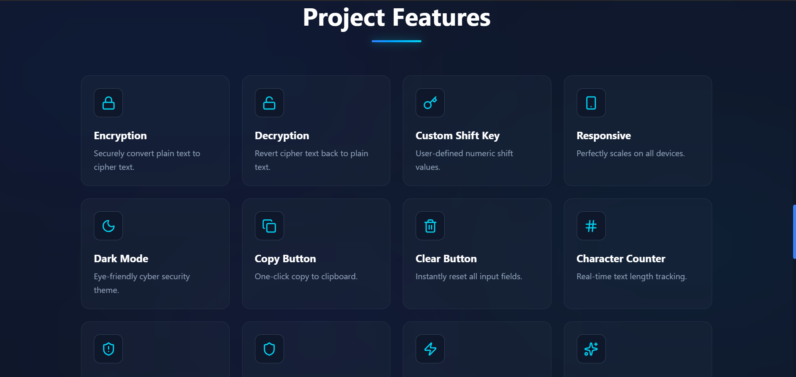
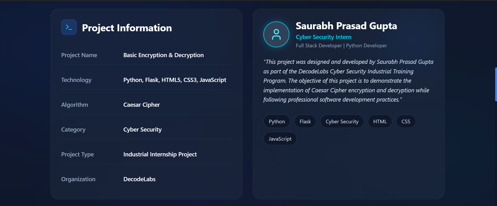

# 🔐 Basic Encryption & Decryption

> **A DecodeLabs Cyber Security Industrial Training Project**

A modern **Basic Encryption & Decryption** web application developed using **Python, Flask, HTML5, CSS3, and JavaScript**. This project demonstrates the implementation of the **Caesar Cipher Algorithm**, allowing users to securely encrypt and decrypt text using a custom shift key.

---

# 📌 Project Overview

This project was developed as part of the **DecodeLabs Cyber Security Industrial Training Program (Batch 2026)**.

The objective of this project is to demonstrate the fundamental concepts of **Data Confidentiality** through the implementation of the Caesar Cipher algorithm. Users can encrypt plain text into cipher text and decrypt it back using the same shift key while understanding the core principles of classical cryptography.

---

# ✨ Features

- 🔐 Caesar Cipher Encryption
- 🔓 Caesar Cipher Decryption
- 🔑 Custom Shift Key
- 📝 Plain Text Input
- 📄 Encrypted Output
- 📄 Decrypted Output
- 📋 One-Click Copy Output
- 🗑️ Clear Button
- 🔢 Character Counter
- 📱 Fully Responsive Design
- 🌙 Dark Cyber Security Theme
- 📖 Caesar Cipher Explanation
- 📚 Project Information Section

---

# 🛠️ Technologies Used

| Technology | Purpose |
|------------|---------|
| Python | Backend Logic |
| Flask | Web Framework |
| HTML5 | Structure |
| CSS3 | Styling |
| JavaScript | Frontend Functionality |
| Caesar Cipher | Encryption Algorithm |

---

# 📂 Project Structure

```text
Basic-Encryption-Decryption/
│
├── src/
├── templates/
├── static/
├── screenshots/
│   ├── home.png
│   ├── encryption.png
│   ├── decryption.png
│   ├── caesar-cipher.png
│   ├── project-features.png
│   └── project-information.png
│
├── app.py
├── cipher.py
├── requirements.txt
├── package.json
├── README.md
└── .gitignore
```

---

# 🚀 Installation

## Clone Repository

```bash
git clone https://github.com/flxtiger/Basic-Encryption-Decryption.git
```

## Move into Project Folder

```bash
cd Basic-Encryption-Decryption
```

## Install Python Dependencies

```bash
pip install -r requirements.txt
```

## Run the Application

```bash
python app.py
```

---

# 💻 How to Use

1. Enter the plain text.
2. Choose a numeric shift key.
3. Click **Encrypt** to generate cipher text.
4. Click **Decrypt** to restore the original text.
5. Copy the output if required.
6. Clear the fields to start again.

---

# 🔐 Caesar Cipher

The Caesar Cipher is one of the oldest and simplest encryption techniques.

Each alphabetic character is shifted by a fixed number of positions defined by the **Shift Key**.

Example:

```
Plain Text : HELLO
Shift Key  : 3

Encrypted  : KHOOR
```

Decryption applies the reverse shift to recover the original message.

---

# 📸 Project Screenshots

## 🏠 Home Page



---

## 🔒 Encryption



---

## 🔓 Decryption



---

## 📖 Caesar Cipher Explanation



---

## 🚀 Project Features



---

## 📋 Project Information



---

# 🎯 Objectives

- Understand classical cryptography.
- Learn Caesar Cipher implementation.
- Practice encryption and decryption techniques.
- Strengthen Python and Flask development skills.
- Build a professional cyber security portfolio project.

---

# 📈 Future Improvements

- Multiple Encryption Algorithms
- AES Encryption Support
- RSA Encryption
- File Encryption
- Password-Based Encryption
- Encryption History
- Export Encrypted Text
- Multi-Language Support

---

# 🎓 Learning Outcomes

Through this project, I gained practical knowledge of:

- Caesar Cipher Algorithm
- Encryption & Decryption Logic
- Python Programming
- Flask Web Development
- Frontend Integration
- Cyber Security Fundamentals
- Data Confidentiality
- Git & GitHub Workflow
- Technical Documentation

---

# 🏢 Internship Details

**Company:** DecodeLabs

**Program:** Cyber Security Industrial Training

**Batch:** 2026

**Project:** Basic Encryption & Decryption

This project was developed during the DecodeLabs Cyber Security Industrial Training Program to strengthen practical knowledge of encryption techniques, secure data handling, and software development practices.

---

# 👨‍💻 Developer

**Saurabh Prasad Gupta**

Computer Science & Engineering Student

Interested in:

- Cyber Security
- Python Development
- Web Development
- Software Engineering

---

# 📄 License

This project is developed for educational and portfolio purposes as part of the DecodeLabs Cyber Security Industrial Training Program.

---

# 🤝 Contributing

Suggestions and improvements are always welcome.

Feel free to fork this repository and submit a pull request.

---

# ⭐ Support

If you found this project useful, please consider giving it a ⭐ on GitHub.

---

# 🙏 Acknowledgement

Special thanks to **DecodeLabs** for providing this Cyber Security Industrial Training Program and the opportunity to gain hands-on experience in encryption, decryption, and secure software development.

---

# ❤️ Thank You

Thank you for visiting this repository.

If you like this project, don't forget to ⭐ Star the repository.