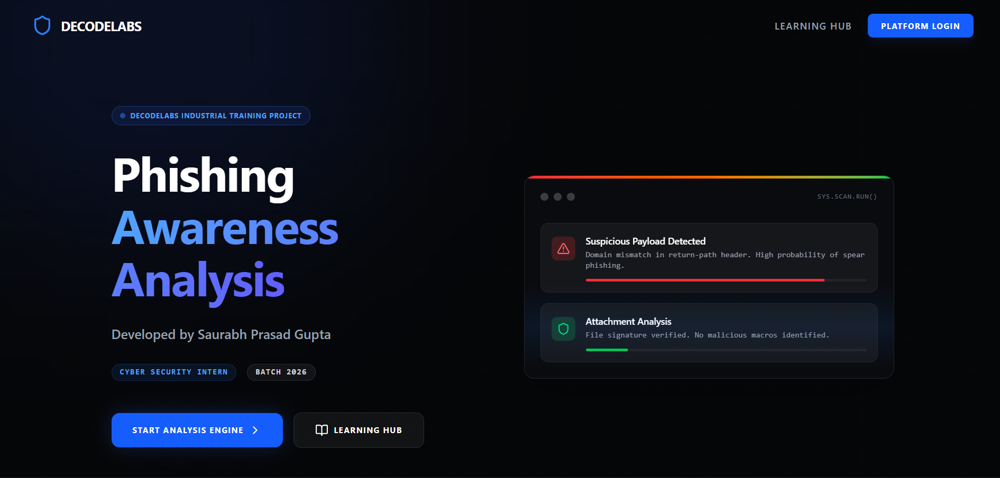
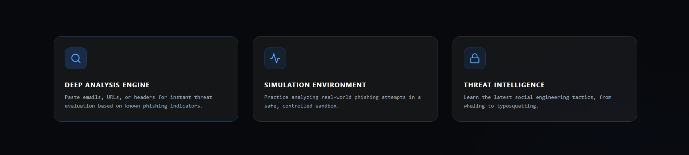
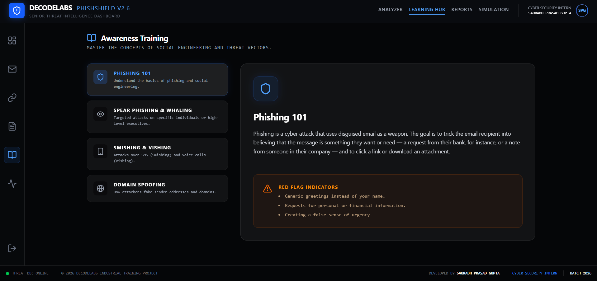
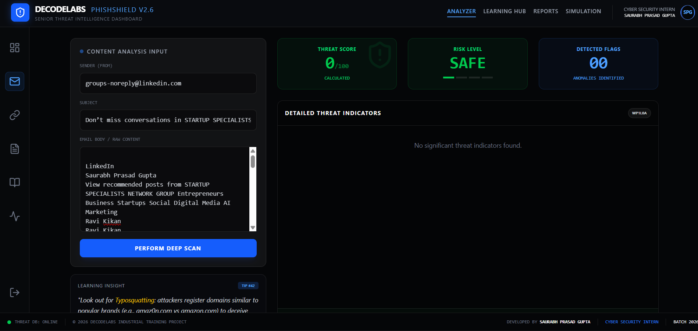
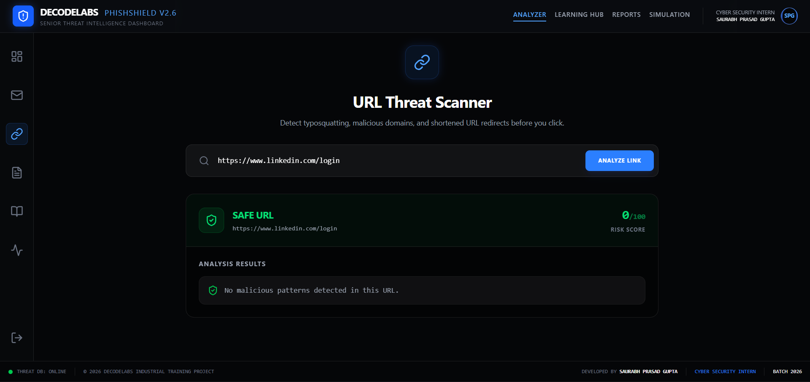
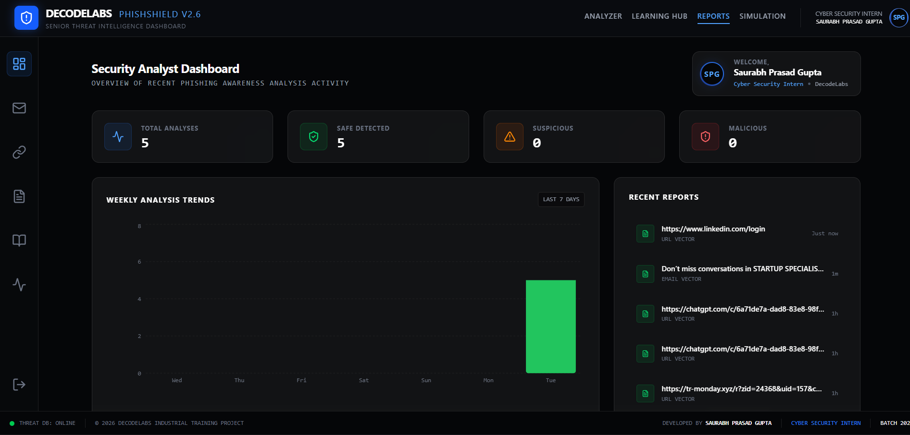
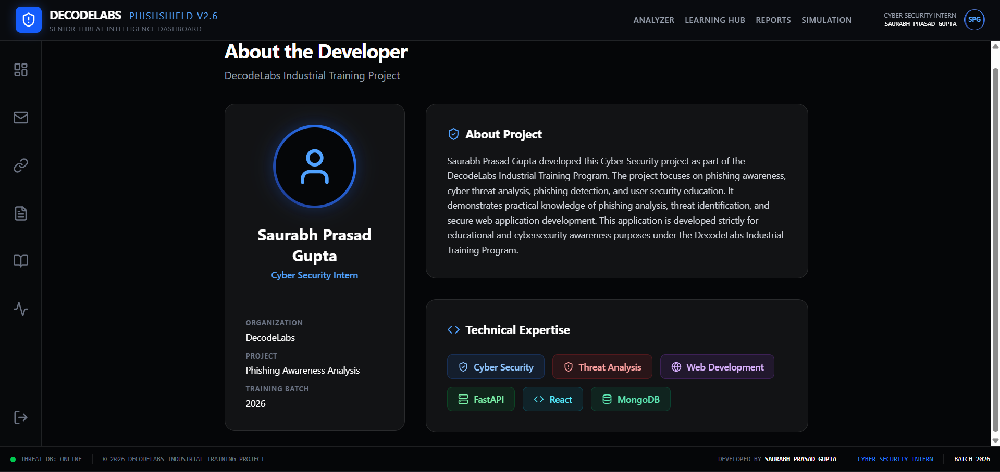

<div align="center">

# 🛡️ Phishing Awareness Analysis

### Cyber Security Internship Project

Developed as part of the **DecodeLabs Industrial Training Program (Batch 2026)**

👨‍💻 **Developed By:** **Saurabh Prasad Gupta**

---


</div>

---

# 📌 Project Overview

**Phishing Awareness Analysis** is a Cyber Security web application developed during the **DecodeLabs Industrial Training Program (Batch 2026)**.

The primary objective of this project is to spread awareness about phishing attacks and help users identify suspicious emails, malicious URLs, and common phishing techniques through an easy-to-use and interactive platform.

This project simulates the basic workflow of a Cyber Security Analyst by providing phishing awareness, educational content, and analysis tools.

---

# 🎯 Objectives

- Increase Cyber Security Awareness
- Educate users about phishing attacks
- Help identify suspicious emails
- Analyze URLs for phishing indicators
- Demonstrate phishing red flags
- Improve safe browsing habits

---

# ✨ Features

- 🏠 Modern Home Page
- 📖 About Phishing
- 📚 Learning Module
- 📧 Email Analyzer
- 🔗 URL Analyzer
- 📊 Dashboard
- 👨‍💻 About Developer
- 📱 Responsive Design
- 🎨 Modern UI
- ⚡ Fast Performance

---

# 🛠️ Technology Stack

| Category | Technology |
|-----------|------------|
| Frontend | React |
| Language | TypeScript |
| Build Tool | Vite |
| Styling | Tailwind CSS |
| IDE | Visual Studio Code |
| Version Control | Git & GitHub |

---

# 📂 Project Structure

```text
phishing-awareness-analysis/

│
├── public/
├── screenshots/
│   ├── home.png
│   ├── about.png
│   ├── learn.png
│   ├── email-analyzer.png
│   ├── url-analyzer.png
│   ├── dashboard.png
│   └── about-developer.png
│
├── src/
│   ├── components/
│   ├── context/
│   ├── pages/
│   ├── services/
│   ├── lib/
│   ├── types/
│   ├── App.tsx
│   └── main.tsx
│
├── README.md
├── package.json
├── vite.config.ts
├── tsconfig.json
└── index.html
```

---

# 📸 Screenshots

## 🏠 Home Page



---

## 📖 About Page



---

## 📚 Learning Module



---

## 📧 Email Analyzer



---

## 🔗 URL Analyzer



---

## 📊 Dashboard



---

## 👨‍💻 About Developer



---

# 🚀 Getting Started

## Clone Repository

```bash
git clone https://github.com/flxtiger/phishing-awareness-analysis.git
```

---

## Open Project

```bash
cd phishing-awareness-analysis
```

---

## Install Dependencies

```bash
npm install
```

---

## Run Development Server

```bash
npm run dev
```

---

## Build Project

```bash
npm run build
```

---

# 📚 Project Modules

- Home
- About
- Learn
- Email Analyzer
- URL Analyzer
- Dashboard
- About Developer

---

# 🎓 Learning Outcomes

Through this project users can learn:

- What is Phishing?
- Email Security
- URL Safety
- Common Phishing Attacks
- Cyber Security Best Practices
- Threat Awareness
- Safe Internet Usage

---

# 🚀 Future Scope

- AI Powered Phishing Detection
- QR Code Analysis
- Machine Learning Integration
- VirusTotal API Integration
- Browser Extension
- Email Header Analysis
- Real-Time Threat Intelligence
- PDF Report Generation

---

# 📷 Internship Project

This project was successfully developed as part of the **DecodeLabs Industrial Training Program (Batch 2026)**.

The project demonstrates practical understanding of:

- Cyber Security Awareness
- Phishing Detection
- Threat Analysis
- Secure Web Application Design
- User Security Education

---

# 👨‍💻 Developer

## Saurabh Prasad Gupta

**Cyber Security Intern**

### Skills

- Cyber Security
- Web Development
- React
- TypeScript
- Tailwind CSS
- Git & GitHub

---

# 🙏 Acknowledgement

I sincerely thank **DecodeLabs** for providing this Industrial Training opportunity and practical exposure to Cyber Security concepts through hands-on project development.

This project was developed for educational and internship purposes.

---

# 📄 License

This project is intended for educational and internship purposes only.

© 2026 **Saurabh Prasad Gupta**. All Rights Reserved.

---

<div align="center">

## ⭐ If you like this project, consider giving it a Star ⭐

### Developed with ❤️ by **Saurabh Prasad Gupta**

**DecodeLabs Industrial Training Program | Batch 2026**

</div>
